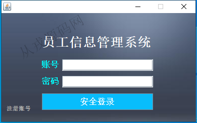
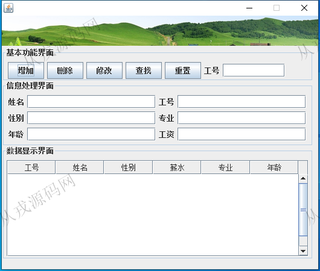
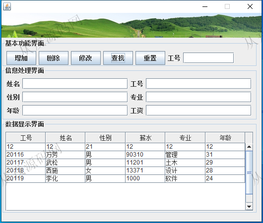
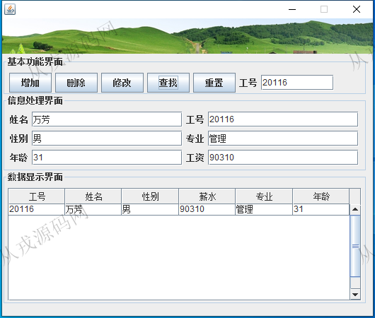

<h1 align="center">205.员工信息管理系统</h1>

 获取sql文件 QQ: 386869957 QQ群: 377586148 

 [更多源码项目: 从戎源码网](https://armycodes.com/) 

## 简介

> 本代码来源于网络,仅供学习参考使用!
>
> 提供1.远程部署/2.修改代码/3.设计文档指导/4.框架代码讲解等服务
> 
> root root
>

## 项目介绍
基于java+swing+awt的员工信息管理系统：集成员工信息的录入、修改、查找、删除等功能于一体的系统。

## 功能介绍

- 基本功能：登录，注册
- 员工信息：员工信息的录入、修改、删除、按工号进行查找

## 环境

- <b>IntelliJ IDEA 2021.3</b>

- <b>Mysql 5.7.26</b>

- <b>JDK 1.8</b>

## 运行截图

